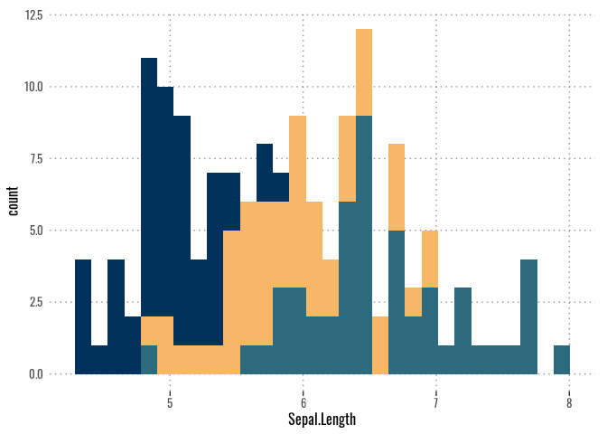

# dscstyle 

<!-- README.md is generated from README.Rmd. Please edit that file -->

<!-- badges: start -->

[](https://www.tidyverse.org/lifecycle/#experimental)
<!-- badges: end -->

The goal of `dscstyle` is to provide a unified style for the [DSC-WAV
project](https://dsc-wav.github.io/www/).

## Installation

You can install the development version from
[GitHub](https://github.com/) with:

``` r
# install.packages("remotes")
remotes::install_github("DSC-WAV/dscstyle")
```

## Example

This is a basic example which shows you how to solve a common problem:

``` r
library(dscstyle)
## Open new R Markdown template
library(ggplot2)
ggplot(data = iris, aes(x = Sepal.Length, fill = Species)) + 
  geom_histogram() + 
  theme_dsc() + 
  scale_fill_dsc()
#> `stat_bin()` using `bins = 30`. Pick better value with `binwidth`.
```


