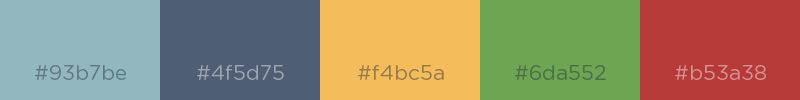

# dscstyle

Report style for the DSV-WAV project


## Installation

Installing from github: `remotes::install_github("zief0002/dscstyle")`


## Usage

**Rmarkdown DSC Report Template**

- In RStudio, navigate to `File > New File > R Markdown...`
- Select `From Template`
- Select the **DSC Report Template** from the template options
- Give the RMD file a name
- Click `OK`

You may need to install the `{showtext}` package prior to the first time you use this template. This allows the Oswald Google font to be used in the plots.

Additionally, you will need to set the chunk option for all plots to include `fig.showtext=TRUE`.

<br />

**DSC ggplot2 Themes and Color Palettes**

- Load package: `library(apstyle)`. (Note this is already included in the initial code chunk if you are using the DSC Report Template.) This package include:
  + `theme_dsc()` 
  + `scale_color_dsc()`
  + `scale_fill_dsc()` 

These scale functions default to a dark color palette (`palette="dark"`). There is also a lighter palette option (`palette="light"`) that can be included in these functions.

<br />

**Dark Palette**


<br />

**Light Palette**



## Example Syntax

````
```{r fig.showtext=TRUE}
ggplot(data=iris, aes(x = Sepal.Length, fill = Species)) + 
  geom_histogram() + 
  theme_dsc() + 
  scale_fill_dsc()
```
````

